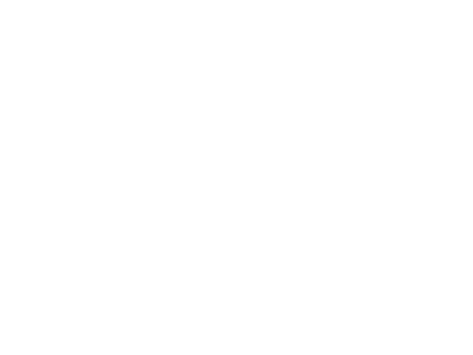

# Lindgram
Playground environment for building formal grammars to generate images based on [Lindenmayer systems](https://en.wikipedia.org/wiki/L-system). The application runs on a Rust backend that acts as a lexer, parser, interpreter for the rules, and generates a byte array that is served to the client via [`tiny_http`](https://github.com/tiny-http/tiny-http).  

Lindenmayer systems usually consist of an alphabet of symbols that can be used to make strings. The alphabet in this application may pertain the set of ASCII characters. Moreover, a set of production rules must be defined that expand each symbol in the starting axiom into a larger form. The rules can be applied iteratively to create interesting generative behavior. 

More generally, the idea is to define a context free grammar as the production rules of the system. The grammar for the production rules is as follows: 
```EBNF
Program := Rules* ;
Rule    := CHAR "=>" CHAR+ ;
``` 
Any ASCII `char` is allowed. However, there are some useful characters:
- `F`: moves forward by the specified amount of line length and draws a line.
- `f`: moves forward by the specified amount of line length, but does not draw a line.
- `+`: rotates anti-clockwise by specified angle.
- `-`: rotates clockwise by specified angle. 
- `[`: push current position and rotation onto the stack.
- `]`: pop current position and rotation off the stack

For example, the starting axiom `A` and the rule `A => AB` can be applied with some depth `n`. 

| `n` | Result |
|-----|--------|
| 0   | `A`    |
| 1   | `AB`   |
| 2   | `ABB`  |
| 3   | `ABBB` |
| 4   | `ABBBB`|

## Quick start
The project depends of `tiny_http` for the web server and `serde_json` to parse json payloads from the client.
```
$ cargo run
INFO: Server started at 0.0.0.0:8000
```
Opening a web browser at http://localhost:8000/ will yield the application. 

## Examples




## References
- http://paulbourke.net/fractals/lsys/